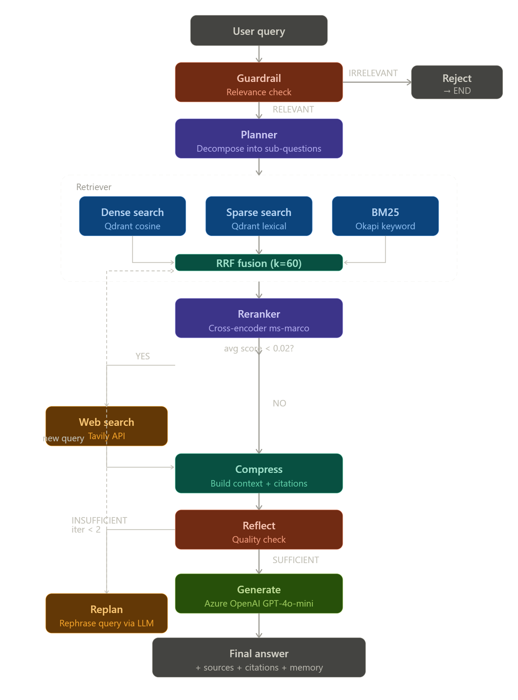

# SciAgent — Agentic RAG over ArXiv Research Papers

> Production-grade research assistant with hybrid retrieval, cross-encoder reranking, agentic reflection loops, DeeepEval evaluation & Memory.

---




## Tech Stack

| Component | Technology |
|---|---|
| Orchestration | LangGraph |
| LLM | Azure OpenAI (GPT-4o) |
| Embeddings | BAAI/bge-m3 (dense + sparse) |
| Vector DB | Qdrant (local Docker) |
| Sparse retrieval | BM25 Okapi (rank-bm25) |
| Fusion | Reciprocal Rank Fusion (RRF) |
| Reranker | cross-encoder/ms-marco-MiniLM-L-6-v2 |
| Web search | Tavily API |
| Evaluation | DeepEval (Faithfulness, Answer Relevancy, Context Recall, Context Precision) |
| Paper source | ArXiv API |
| PDF extraction | PyMuPDF |
| Chunking | LangChain RecursiveCharacterTextSplitter |

---

## Project Structure

```text
SciAgent/
├── config.py                        # all constants, paths, model names
├── .env.example                     # API keys template
├── requirements.txt
│
├── app/
│   ├── env_setup.py                 # HuggingFace offline cache config
│   │
│   ├── ingestion/
│   │   ├── arxiv_fetcher.py         # ArXiv SDK → PDF download → text extract
│   │   ├── chunker.py               # RecursiveCharacterTextSplitter, 1500 chars
│   │   └── embedder.py              # BGE-M3 → dense (1024d) + sparse vectors
│   │
│   ├── indexing/
│   │   ├── bm25_index.py            # BM25Okapi build, persist, search
│   │   └── vectorstore.py           # Qdrant upsert, dense_search, sparse_search
│   │
│   ├── retrieval/
│   │   ├── hybrid_retrieval.py      # RRF fusion of dense + sparse + BM25
│   │   └── reranker.py              # CrossEncoder reranking
│   │
│   ├── graph/
│   │   ├── state.py                 # AgentState TypedDict
│   │   ├── nodes.py                 # all node functions + routing logic
│   │   └── graph.py                 # LangGraph StateGraph wiring
│   │
│   ├── tools/
│   │   ├── llm.py                   # Azure OpenAI client wrapper
│   │   └── tavily_client.py         # Tavily web search
│   │
│   ├── api/
│   │   ├── schemas.py               # Pydantic request/response models
│   │   └── dependencies.py          # agent singleton
│   │
│   └── utils/
│       └── logger.py                # structured logger
│
├── data/
│   ├── papers/                      # downloaded PDFs + metadata.jsonl
│   ├── indexes/                     # bm25_index.pkl
│   ├── qdrant/                      # Qdrant persistent storage
│   ├── eval_data/                   # cached weights
│   └── logs/                        # structured logs
│
├── evals/
│   ├── eval.py                      # DeepEval pipeline evaluation
│   └── generate_testset.py          # synthetic Q&A generation
│
├── main.py
└── requirements.txt
```

## Setup

### 1. Clone and create environment

```bash
git clone https://github.com/yourname/sciagent.git
cd sciagent
conda create -n sciagent python=3.12
conda activate sciagent
pip install -r requirements.txt
```

### 2. Configure environment variables

```bash
cp .env.example .env
# Fill in your Azure OpenAI and Tavily keys
```

### 3. Start Qdrant

```bash
docker run -d --name qdrant -p 6333:6333 --memory=1.5g \
  -v $(pwd)/data/qdrant:/qdrant/storage qdrant/qdrant
```

### 4. Ingest papers

```bash
python -m app.ingestion.pipeline_test
```

### 5. Run the agent

```bash
python -m app.graph.graph
```

### 6. Run the API

```bash
uvicorn app.api.main:app --reload --port 8000
```

API docs available at `http://localhost:8000/docs`

---

## Retrieval Pipeline

### Why Hybrid?

Pure dense retrieval misses exact keyword matches (method names, acronyms, author names). Pure BM25 misses semantic similarity. Combining all three with RRF consistently outperforms any single approach.

| Retrieval | Strength |
|---|---|
| Dense (BGE-M3) | Semantic similarity |
| Sparse (BGE-M3) | Exact term matching |
| BM25 | Keyword frequency |
| **RRF Fusion** | **Best of all three** |

### Why BGE-M3?

BGE-M3 produces dense AND sparse vectors in a single forward pass — no separate sparse encoder needed. On CPU it uses ~3GB RAM which fits the 8GB constraint.

### Why Cross-Encoder Reranking?

Bi-encoders (like BGE-M3) encode query and document independently — fast but imprecise. Cross-encoders see the query and document together — slower but significantly more accurate. Running it only on the top-20 RRF results keeps latency acceptable.

---

## Agentic Design

The agent is not a simple RAG chain. It makes decisions:

1. **Guardrail** — rejects irrelevant queries before wasting retrieval compute
2. **Planner** — decomposes complex queries into sub-questions, retrieving for each
3. **Web search** — triggered automatically when local retrieval confidence is low
4. **Reflect** — evaluates context quality, retries retrieval up to 2 times if insufficient

This reflection loop is what makes it agentic. A static RAG chain always generates regardless of context quality.

---

## Evaluation

RAGAS metrics on 20 samples from the generated testset:

| Metric | Score |
|---|---|
| Faithfulness | 0.8833 |
| Answer Relevancy | 0.7767 |
| Context Recall | 1 |
| Context Precision | 0.8 |

*Run `python -m evals.eval` to populate these scores.*

---

## Hardware Requirements

| Component | Minimum |
|---|---|
| RAM | 8GB (tight but workable) |
| CPU | i5 or equivalent |
| Disk | 10GB (models + papers + Qdrant) |
| GPU | Not required |

### Memory breakdown at runtime

| Component | RAM Usage |
|---|---|
| BGE-M3 | ~3GB |
| Cross-encoder | ~400MB |
| Qdrant (Docker) | ~1.5GB |
| Python process | ~500MB |
| **Total** | **~5.5GB** |

---

## Topics Indexed

- Artificial Intelligence
- Computer Vision
- Natural Language Processing
- Statistics & Statistical Learning
- Deep Learning

---

## API Reference

### POST /query

```json
{
  "query": "What is the attention mechanism in transformers?"
}
```

Response:

```json
{
  "answer": "...",
  "sources": ["Paper Title — http://arxiv.org/..."],
  "web_search_used": false,
  "sub_questions": ["...", "..."]
}
```

### GET /health

```json
{
  "status": "ok",
  "qdrant": "OK- 7769 points",
  "bm25_index": "OK — 7769 chunks",
  "collection": "research_papers"
}
```

---

## Limitations

- BGE-M3 on CPU is slow (~5-10s per embed query). A GPU or ONNX export would cut this to <1s.
- Corpus is limited to downloaded papers. Re-run ingestion to expand coverage.
- DeepEval evaluation requires Azure OpenAI calls — costs tokens per sample.
- Windows symlink warnings from HuggingFace cache are cosmetic and harmless.

---

## License

GENERAL APACHE LICENSE